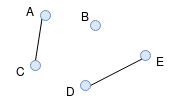
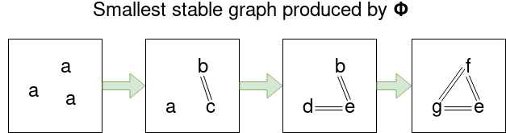
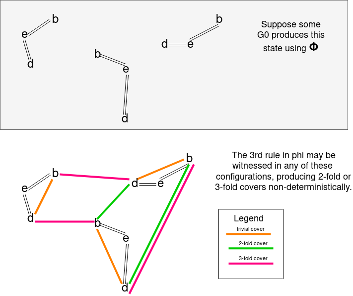
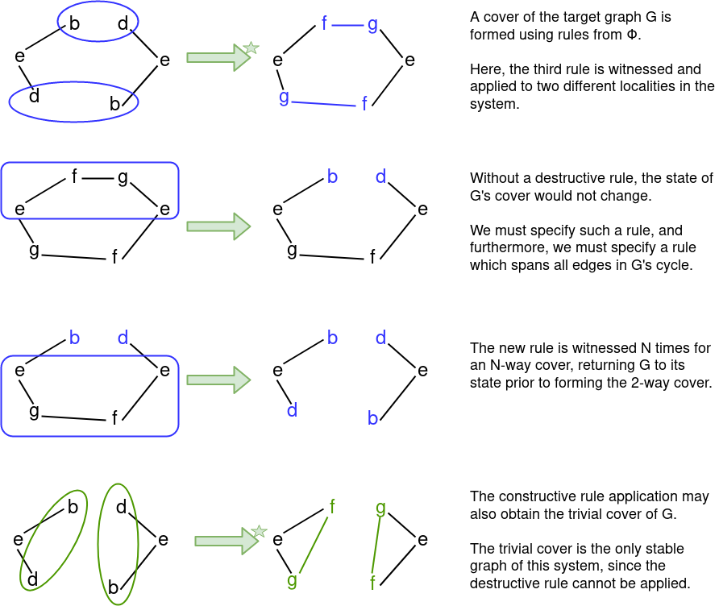

# Digest of _Graph Grammars for Self Assembling Robotic Systems_ by Klavins et al

The mathematics illustrated in [the aforementioned paper](klavins_graphgrammars.pdf) 
may be confusing and appear unapproachable for an engineer without the 
benefit of advanced study of mathematics. The key points of the paper are 
restated here for clarity, and to orient subsequent research in this topic.

## Language Clarification

The following terms are used which are not present in the original 
publication:

1. **Identity** is used to distinguish a single unique vertex or edge, 
   much like a fingerprint or DNA sequence does for a human being. It is 
   distinct from _label_, which is formally defined in the paper. 
   Similar terminology is used in the work by Bishop et al.
   Such a distinction is useful for us when describing the preservation of 
   members between sets and establishing a one-to-one relationship between 
   one or more members of disparate sets, despite the corresponding labels 
   for set members being in flux. Pointer addresses are a useful analogy for 
   computer science professionals, though not a fully sufficient analogy 
   due to object destruction and the possibility of the allocation of the 
   previously used address for a different unique object.

## Defining a Graph

**_G = (V, E, l)_**

A graph is defined as a triple consisting of a set of vertices _V_, a set 
of vertex pairs representing edge relationships between the 
vertices (_E_), and a function &ell; which assigns a string label to each vertex. 

This definition is more explicitly named as a **simple labeled graph**, 
and such a distinction matters due specifically to the labeling mechanism, 
which isn't a typical component of a graph structure in computer science. 

This type of labeling mechanism becomes particularly useful for visually 
interpreting the state of a particular graph, and for identifying 
disparate graphs which have identical or similar states.

#### Graph Connectivity

Two vertices in a graph _G_ are **connected** if there is a path (sequence 
of edges) connecting them in _G_. 

Graph connectivity serves as an equivalence partition on _V_; each subset 
of _V_ shares the property that all members of the subset are connected 
in _G_. 

For instance, consider the following graph _G_:



We suppose _V<sub>G</sub> = { A, B, C, D, E }_. We further deduce that 
the connectivity relation on _V<sub>G</sub>_ is _{ {A, C}, {B}, {D, E} }_. Each 
subset of the connectivity relation is called a **component**.

Formally, a connected graph _G_ has only a single component; that is, 
there are no two vertices in _G_ that are not connected through one or 
more sequence of edges.

In layman's terms, a connected graph has no nodes which are orphaned 
from each other; all supplied vertices in _V<sub>G</sub>_ are linked 
together by at least one path.

## Defining Embeddings

In Part A, a label preserving embedding (or label-preserving embedding) function 
is defined as ***h : G<sub>1</sub> --> G<sub>2</sub>*** with the following 3 properties:

1. _h_ is injective, implying that _G<sub>1</sub>_ is a subset of _G<sub>2</sub>_; this does not 
   imply that _G<sub>1</sub>_ is a proper subset of _G<sub>2</sub>_. If the two edge and vertex sets are equal, 
   _h_ is considered bijective. When this is true, the graph can be 
   considered isomorphic (structurally identical). A review of the formal 
   definition of graph isomorphism (see Rosen et. al.) shows that a one-to-one 
   function exists that relates &ell; of _G<sub>1</sub>_ to &ell; of _G<sub>2</sub>_, and that the equality 
   of edge sets of _G<sub>1</sub>_ and _G<sub>2</sub>_ can be demonstrated with the application of this 
   one-to-one function.
2. Each vertex pair present in _E_ of _G<sub>1</sub>_ is also present in _E_ of _G<sub>2</sub>_, 
   and _h_ relates the two pairs. An application of _h_ may result in a label 
   mapping change, and this property will still be true.
3. The labeling function of _G<sub>1</sub>_ may be reproduced by the labeling function 
   of _G<sub>2</sub>_ as a function of h.

Embeddings become particularly useful in Definition 3.2, which states that 
an arbitrary graph _L_ may be considered a subsection of an arbitrary graph 
_G_ when an embedding _h_ exists. The function _h_ is called a _witness_ 
when this is true.

In practical terms, an embedding guarantees by definition that _L_ can 
be mapped to a portion of _G_, up to and including the entirety of _G_. 
When _h_ is bijective, _L_ is isomorphic to _G_.

## Defining Rules

In Definition 3.1, a rule _r_ is given as a pair of graphs _(L, R)_. In a rule, 
_V_ in _L_ is equal to _V_ in _R_ (both in magnitude and member identity). 

In essence, a rule acts on a fixed number of vertices in isolation from 
the rest of the universe.

### Rule Types

Rules have several emergent properties which are quantified here.

#### Transformative Types

If we assume that _L_ and _R_ are not necessarily equal, then _E_ and/or 
&ell; must differ. The paper further quantifies types of rules:

* A constructive rule is symbolically defined by _E_ of _L_ being a proper subset of _R_'s 
edge set.
* In a destructive rule set, _E_ of _R_ is a proper subset of _L_'s edge set. 

However, the symbology of this definition is in debate due to inconsistency 
in the notation of proper subsets. 

The paper further defines mixed rulesets as being neither constructive 
nor destructive. We have interpreted this new rule type to imply one of 
the two properties:

1. Under the constraints listed above, the rule neither produces a new 
   identified edge nor removes an edge which existed in _L_. Such an interpretation 
   implies that only &ell; is changed between _L_ and _R_, since the identitified 
   edges between _L_ and _R_ would remain the same. The trivial example 
   given in the paper's Example 3.3 supports this interpretation of a mixed 
   rule, and all given examples of constructive and destructive rules imply 
   proper containment based on vertex and edge identities.
2. If we do not require that _L_ and _R_ are inequal or that the edge sets 
   are required to be proper subsets for constructive or destructive rules, 
   the possible behaviors for rules grow and additional options for mixed 
   rules present themselves. Such a rule may simultaneously create a new edge 
   and destroy an existing edge, relabel vertices only (as in #1), 
   or perform no action at all (so that _L_ and _R_ are equal).

Some clarification on the types of rules and rule behavior is needed.

#### Cyclical Types

From the paper:

> A rule is **acyclic** if its right hand graph contains no cycles. 
> The left hand may contain cycles.

### Rule Applicability

Revisiting Definition 3.2, we understand that a rule is **applicable** to 
some arbitrary graph _G_ when an embedding function _h_ exists between 
_L_ and _G_. This does not imply that _R_ is applicable to graph _G_; 
_R_'s applicability is determined by a separate rule-witness pair that 
uses _R_ as the first member of its pair.

## Action Definition

An **action** on a graph _G_ is the pair _(r, h)_ such that _r_ is applicable 
to _G_ when witnessed by function _h_.

Essentially, an action is a codified transformative event for some portion of _G_; 
the transformation is effected on a portion of _G_ defined by _r_.

### Action's Impact on _G_

The **application** of an action to _G_, producing _G'_, has the following effects:

* _V' = V_; the magnitude and member identities of _V_ do not change.
* _E'_ is produced; it consists of the union of all edges in _R_ and the 
  set difference _E - { e | e &isin; E<sub>L</sub> }_.
* _l'_ is produced; it stipulates that labels do not change for all vertices 
  which were not present in _L_, and labels for _L_'s vertices are changed 
  according to _R_'s labeling function.

## Graph Assembly

### Graph Assembly Systems

An **assembly system** for a graph is formally defined in Definition 3.4 and 
consists of a pair: _(G<sub>0</sub>, _&Phi;_)_.

_G<sub>0</sub>_ represents an initial unbounded graph defined by the following 
graph tuple:

**G<sub>0</sub> = (&naturals;, &empty;, &lambda;x.a)**

We can consider _&naturals;_ to be vertex identities for _G<sub>0</sub>_; 
however, Example 3.1 in the paper demonstrates that these vertex labels 
may be used interchangably with rule graphs and that they do not uniquely 
identify vertex members in the way _identity_ is used in our definitions.

&Phi; denotes a set of rules (referred to interchangably as a rule set).

### Assembly Sequences

An assembly sequence is defined in Definition 3.5 and describes the possible 
graph configurations that can be produced from _G<sub>0</sub>_ using &Phi;. 

It is in this definition that we begin to understand that the witness function 
_h_ refers to a **unique identified** portion of _G_; to quote the paper 
directly:

> The [graph assembly] system is non-deterministic since, at any step, many 
> rules in &Phi; may be simultaneously applicable, each possibly **via several 
> witnesses**.

### Graph Reachability

A formation (graph) _M_ is reachable in an assembly system (_G<sub>0</sub>_, &Phi;) 
when there is a rule in the assembly system whose right-hand side contains 
a component which is isomorphic to _M_.

This implies that the graph _M_ can be obtained in the assembly system by 
some valid sequence of rule application.

### Graph Stability

Stable graphs are a subset of reachable graphs; the desired 
formation _M_ be achieved in the assembly system. In addition, for _M_ to 
be a stable formation in the assembly system, there are no rules in the 
assembly system containing &Phi; which contain any part of _M_ in its 
left-hand side.

This implies that the graph _M_ has reached a terminal state in this 
assembly system and cannot be further modified by any rules.

## Theorems

### Theorem 3.1

As stated in the paper:

> Let &Phi; denote an acyclic rule set. Then any cover of a graph in the 
> reachable set is also in the reachable set. In particular, the reachable 
> set has infinitely many isomorphism types of graph if it contains any 
> graph with a cycle.

#### Acyclic Rule Sets

The paper does not rigorously define an **acyclic rule set**. The agreed-upon 
definition we use here is based off of the definition of an acyclic rule: 

> A rule is **acyclic** if its right hand graph contains no cycles. 
> The left hand may contain cycles.

Extending this to a rule set, we conclude that an acyclic rule set contains 
no rules whose right hand graph contains cycles.

#### Proof

The proof in the paper is reasonably clear in its approach, even if the 
reader's knowledge of algebraic topology leaves much to be desired. The 
proof begins with an arbitrary N-way cover of _G_ and shows that the 
same ruleset which disassembles the cover may also disassemble _G_. 

An example of this behavior in the construction of an N-way cover is 
as follows:

Construct a ruleset which produces covers. The ruleset presented here 
produces an unlimited number of stable graphs, and the smallest stable 
graph is a 3-node cycle.

```
phi = { a a --> b-c
        a c --> d-e
        b d --> f-g }
```



We can confirm that this ruleset meets the preconditions of the theorem; 
&Phi; is acyclic.

We can show that the third rule can be witnessed in several different 
ways, and that particular witness combinations produce node chains that result in 
stable (and by definition reachable) covers of the 3-node cycle.



#### Implications

Several observations come to mind:

1. Formation of covers of cyclic graphs can be eliminated by specifying a 
   rule in &Phi; where _L_ is a single connected graph. However, if 
   this rule is constructive, the rule set is no longer acyclic.
2. The author's remark in Example 3.2 states `Theorem 3.1 implies 
   binary rules are insufficient to construct a unique stable cycle`. 
   We see this illustrated clearly in the example given above.
3. The formation of a cover may always be undone by specifying a destructive 
   rule, one which spans a node chain that is not present in the trivial 
   cover. _This is an important consideration for Theorem 3.2._

### Theorem 3.2

Theorem 3.1 demonstrates that binary constructive acyclic rules may 
produce an unbounded number of covers when the stable set of graphs for 
some &Phi; contains the trivial cover, particulary when the trivial 
cover contains a cycle.

It is important to demonstrate how covers may be eliminated from the 
stable set if desired, since the goal of the paper (and this author's 
efforts) is to produce a single stable graph, even when it contains 
cycles.

Theorem 3.2 is stated as follows:

> Assume that &Phi; is an acyclic rule set, and that the stable set 
> contains a graph _G_ &isin; _S_(&Phi;) but not any of _G_'s covers. 
> Then for each edge _e_ &isin; _E_(_G_), there exists a rule in &Phi; 
> whose left-hand side contains a copy of every edge of some cycle in 
> _G_ passing through _e_.

#### Proof

Theorem 3.1 demonstrated that when a rule set is acyclic, the reachable 
set of graphs contains an unbounded number of covers of _G_ when _G_ 
contains a cycle. In both theorems, the rule set is stated to be acyclic, 
implying that _G_ as given in Theorem 3.2 must also contain all 
covers in the reachable set.

A clear distinction between the reachable and stable sets of a graph 
assembly system must be understood. The key distinction is whether 
a graph formation _G<sub>K</sub>_ has any rule in &Phi; which may be 
applied; when this is true, _G<sub>K</sub>_ is by definition unstable.

Under the hypothesis of Theorem 3.2, the covers which are reachable 
cannot be stable. The definition of stable formations dictates that a 
rule can be applied to the reachable cover. Thus, a rule must exist in 
&Phi; which can be applied to the cover _G'_. Furthermore, this rule 
cannot be applicable to the stable graph _G_, because _G_ is stable by 
definition.

In order to achieve these properties, what additional behaviors must 
be exhibited by this assembly system? 

1. All covers of _G_ must have some means of reverting to another state, 
   one which may eventually lead to the stable graph _G_.
2. The means of state transformation must not be applicable to _G_ itself.

In order to satisfy these objectives, a rule must be produced where the 
beginning state _L_ specifies a connected path which contains all edges 
of a cycle that _G_ may produce plus at least one additional edge. 
Whether _L_ contains a cycle is immaterial; the key constraint is that 
_L_ is not applicable to _G_ so that _G_ is indeed stable.

The example provided to illustrate Theorem 3.1 is as follows:

```
phi = { a a --> b-c
        a c --> d-e
        b d --> f-g }
```

In order to satisfy the hypothesis's constraints, a single rule is added:

```
phi = phi U { e-g-f-e --> e-d b-e }
```

If we apply this new rule to arbitrarily-sized covers of _G_, we discover 
that covers are broken down without fail due to the final rule's applicability 
to covers of _G_. 

However, the rule must be designed so that it cannot be applied to _G_ itself, 
since _G_ is defined to be stable. To achieve this, we must specify two nodes 
in the left side of the rule which cannot belong in the same stable cycle; that 
is, the rule must include nodes which belong to separate copies of _G_. To do 
that, the rule must have a copy of every labeled node in _G_'s cycle plus one 
node, and by implication, the rule must have a copy of every edge in _G_'s cycle.



#### Implications

1. The rule or rules in &Phi; which satisfy this theorem are most likely 
   destructive, or lead to additional destructive rules. This property 
   must be true to reduce an N-way cover to the trivial cover.
2. The same pattern of witnesses and rules which form covers and revert 
   the covers' state can be applied forever in loops. Supplying rules which 
   ensure a cover is not a stable formation doesn't guarantee that the 
   stable graph will be formed.
