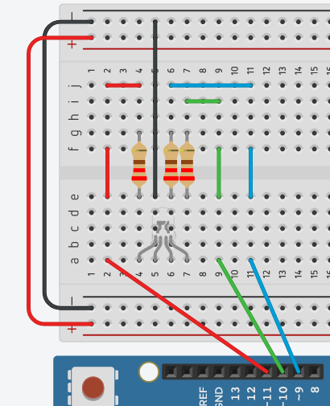
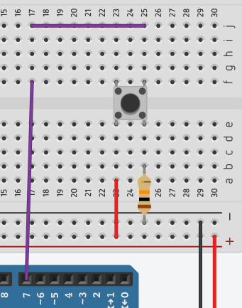
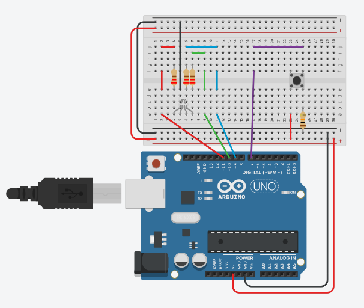
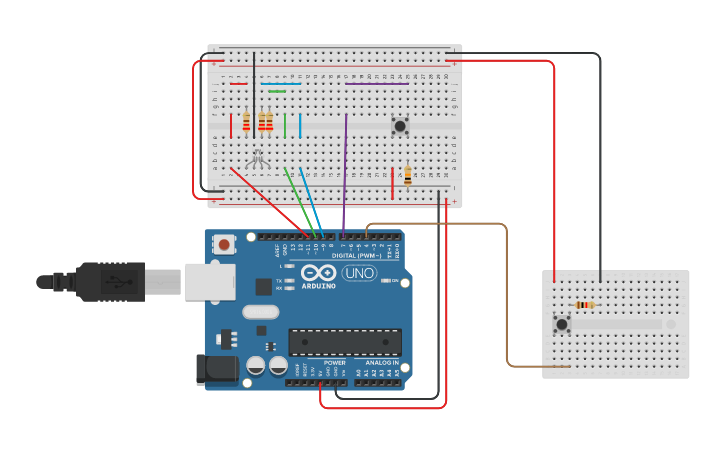
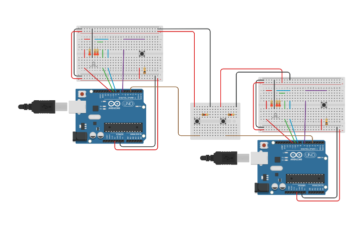
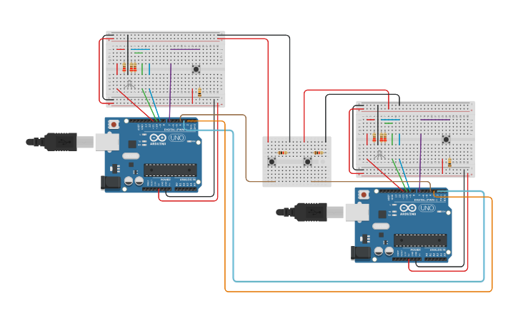

# About the Arduino Implementation

This implementation uses two boards with serial lines for reading and 
writing data to each other, plus standard serial output for general 
information about system state and events.

A board can be manually set to any valid label in the ruleset when the 
system is in an idle state; this is done with a pushbutton.

There are two additional pushbuttons which, when pressed, trigger the 
logic for a connective event in the system.

In addition to standard serial output displaying system state and 
event outcomes, a RGB LED has been used to visually indicate success or 
failure of an event.

## Wiring the Setup Together

### Set up each board's individual status LED.

Each color on the LED needs to be connected its corresponding digital pin with a 220&#8486; resistor in series. The cathode pin on the LED is connected to ground.



### Set up each board's state cycling button.

One side of the button has a 5V line leading into the button and a ground line leading out, with a 10K&#8486; resistor in series with the ground line.

On the other side of the button, opposite the ground line, a line should connect the button's pin to digital pin 7 on the Arduino.



Each board's individual device setup should look like this:



[View the Tinkercad schematic.](https://www.tinkercad.com/things/ad7iGvBdCdT)

### Set up board's connective event button.

A similar button setup is created for initiating a connection event. The button's output line should be connected to digital pin 4 on the Arduino. This button is set up on a separate mini breadboard for clarity.



[View the Tinkercad schematic.](https://www.tinkercad.com/things/eW3hlQi3E23)

### Set up second board with identical setup using previous steps.

After setting up second board, the devices should be configured as follows:



[View the Tinkercad schematic.](https://www.tinkercad.com/things/6L1DwyzBF5q)

### Connect RX and TX lines between the two boards for serial communication.

Connect digital pin 2 (RX) on the first board to digital pin 3 (TX) on the second board, so that board 2 can send data to board 1. Connect a second line so that board 1 can send data to board 2.



[View the Tinkercad schematic.](https://www.tinkercad.com/things/5IB2VWTB7U2)

## Tips and Tricks for Working with Arduinos

### Load sketch onto boards

To load a new `.ino` routine on a board:

* Plug the board(s) into the computer via USB.
* Run `sudo chmod a+wr /dev/ttyACM*` or its equivalent for the names of the mounted devices.
* Load via Arduino IDE:
    * Launch the Arduino IDE, and open the sketch you want to upload.
    * Select the board you want to target under Tools &#x2192; Port.
    * Click Verify & Upload to upload the sketch.
* Load via `arduino` CLI:
    * `arduino --upload /path/to/sketch.ino --port /dev/ttyXXXX` with the correct file name and device name.
    * Read [the CLI docs](https://github.com/arduino/Arduino/blob/master/build/shared/manpage.adoc) for more options.

To view the `Serial` output of both boards without using the Arduino IDE, 
you can tail the output of the mounted device from your computer.

* Plug the board(s) into the computer via USB.
* Run `sudo chmod a+wr /dev/ttyACM*` or its equivalent for the names of the mounted devices.
* For the devices you want to monitor, open a terminal session and run `screen` for that device. For example, to view the serial data on `/dev/ttyACM0`, run:
  ```
  screen /dev/ttyACM0
  ```
* To exit the screen session, press `Ctrl + a` and then `k`.
